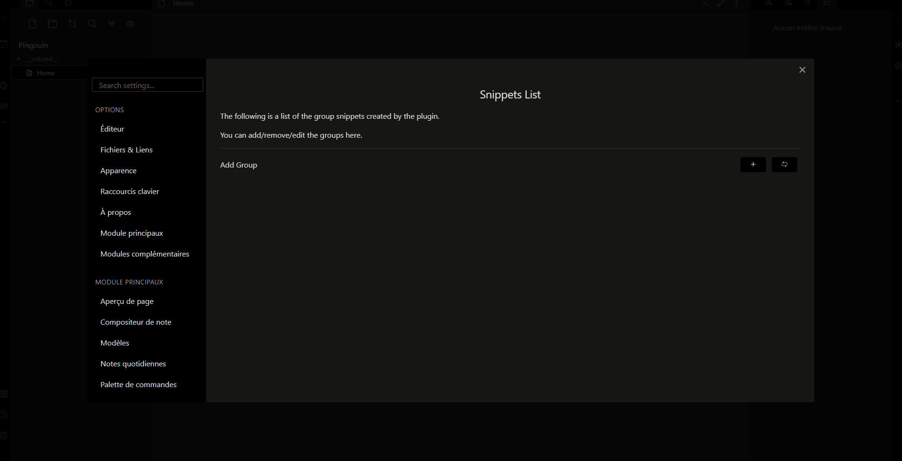

-> [FR](docs/README_FR.md)

# Obsidian Group Snippet

This plugin allow you to set group of CSS snippets to class them and enable them in one click (or command). Also, this plugin allows you to 'link' a group of snippets to a theme, enabling it when you **switch theme** ! It works also for switching between light & dark theme !

## Usage

1. Go to the Settings of the plugin
2. Add a group (clicking on the + button)
3. Add a name to the group
4. Click on the `edit` button to add CSS snippets to the group

After this, you have your group of CSS snippets ! 🎉🎉

The plugin will enable the **enabled** snippet, and **disable** the disabled snippets!

To run the commands, you can :
1. From command palette
	1. `reload snippets` to reload the group of snippets (and the newly added groups)
	2. `Activate the group : ${groupName}` to activate the group
2. From directly the settings tab by clicking on the command windows icon.

You can also enable every snippets in the group by clicking on the `eye` icon. Clicking on the cross will disable every snippets in the group.

Also, and it's my game changer here! You can automatically switch group snippets based on your theme or color scheme!
The switch is based on the **group name**, and the **theme name**. The group name **must** include the theme name, and optionally the color scheme name based on `dark` or `light`.[^1]
For example, `minimal dark` will be enabled if you switch to the dark theme or from any theme to minimal, in a dark color scheme. 

Moreover, snippets linked to other theme (or color Scheme) will be disabled 😀 !

The plugin will also detect if you set a snippet for mobile or desktop. Just put :
- IOS, Android, Mobile for a mobile group
- Desktop, PC, windows, mac, linux, for a desktop group

Finally, each time you switch of theme/color scheme, the plugin will toggle[^2] snippets with a name containing : 
- The same platform you are on 
- The same theme you are on or switch to
- The same color scheme you are on or switch to
- Any snippets with no indication of platform/theme/color scheme

When switching, the plugin will disable the snippets in the group that : 
- Have a different platform in name than the current one
- Have a different theme you are on or switch to 
- Have a different color scheme you are on or switch to

Normally, this plugin can totally override the `Appareance` for Snippets !

🗒️ Some notes : You need to reload the snippets (using the button refresh) when you remove snippets. But, no worry, the plugin can't activate snippet that doesn't exist ! It's just the list that need some refreshing :).

## 🤖 Development

1. Fork the repository on GitHub
2. Clone the repository on your computer
3. Run `npm install` in the cloned repository
4. Run `npm run build` in the cloned repository to build the plugin, you can also use `npm run dev` to watch the changes !

## Credit and thanks
- [MySnippets](https://github.com/chetachiezikeuzor/MySnippets-Plugin)
- [Snippets Commands](https://github.com/deathau/snippet-commands-obsidian)

[^1]: The translation of the plugin apply for color scheme with addition with the english `dark` and `light`.
[^2]: Here, toggle meaning that the plugin will disable the disabled snippets and enable the enabled snippets in the group list, mimic the behavior of toggling snippet in the Snippet CSS from Appearance tab.
